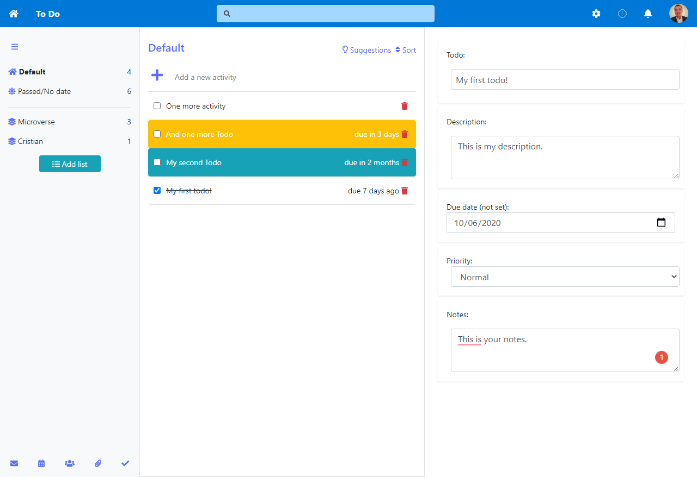

  

# [Microsoft todo web app](https://to-do.microsoft.com/tasks/) clone built with webpack, HTML and CSS in 2 days.

> The guests can create lists of todos, add/delete and edit todos based on their description/priority/due date/notes and title. The app never does a full refresh of the page and it automatically updates the DOM with every change. It is using `localStorage` for the database.  
> In this project, we were required to build a todo web app using Javascript`s Objects, Factory Functions, and The Module Patterns applying the concepts of Single Responsibility and Tightly Coupled Objects.

## App functionality

- Guests can create lists of todos, add/delete and edit todos based on their description/priority/due date/notes and title.
- The app is currently not mobile responsive.

## This web app is live, you can check it here: [Live demo](https://cristianceamatu.github.io/microverse-js-todolist/)

## Screenshots of the app.

## Built With

- HTML/SCSS
- Webpack/ES6/Javascript
- Bootstrap
- FontAwesome
- Local storage

## Prerequisities

To get this project up and running locally, you must clone this repository or download the files and double click on `index.html` found in the `dist` folder.

## Authors

👤 **Cristian Viorel Ceamatu**

- Email: [cristian.ceamatu@gmail.com](cristian.ceamatu@gmail.com)
- Github: [https://github.com/cristianCeamatu](https://github.com/cristianCeamatu)
- Twitter: [https://twitter.com/CristianCeamatu](https://twitter.com/CristianCeamatu)
- Linkedin: [https://www.linkedin.com/in/ceamatu-cristian/](https://www.linkedin.com/in/ceamatu-cristian/)

## 🤝 Contributing

Our favourite contributions are those that help us improve the project, whether with a contribution, an issue, or a feature request!

## Show your support

If you've read this far....give us a ⭐️!

## 📝 License

This project is licensed by Microverse and the Odin Project
